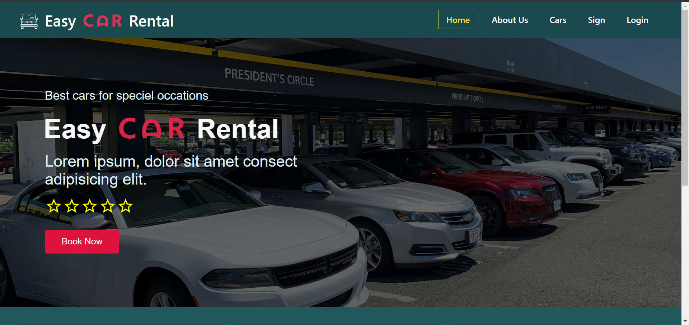
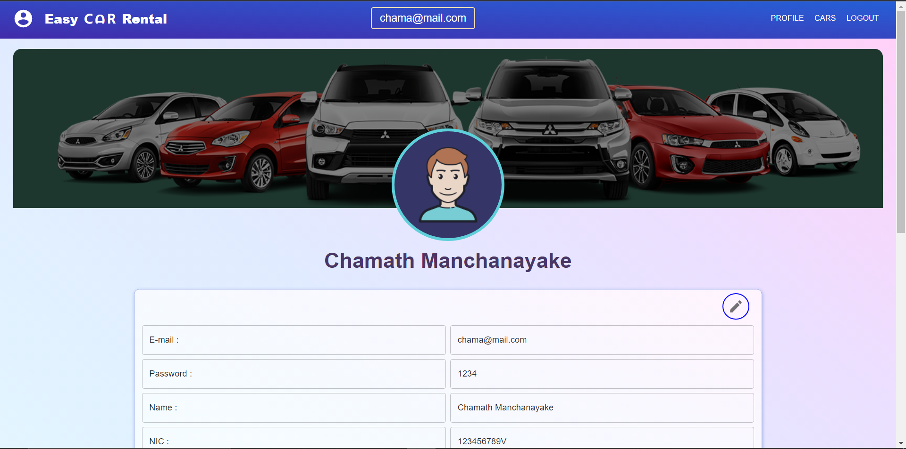

# **Easy Car Rental System**

## **Business Process.**
1. A customer comes to the website and register.
2. When registering, the customer has to upload a driving license or an identity card to the system.
3. Then, the customer can select a car, Pick up time and date, and other required details.
4. The customer has to make the Loss Damage Waiver payment to the given bank account information of the car rental and upload the bank slip or the bank confirmation to the dedicated field in the renting view. (Loss Damage Waiver payment for is 10,000.00 LKR for general cars, 15,000.00 LKR for Premium cars, and 20,000.00 LKR for Luxury cars)
5. If a driver is requested by the customer, a driver is randomly assigned to accommodate the customer. (Drivers can view their weekly schedule from the website.)
6. After the customer completed the above steps, the admin can confirm or deny the rental request. However, the Loss Damage Waiver payment will be returned to the customer after handing over the car or if the customer cancels the rental request.
7. After the customer returns the car, he/she has to make the payment and the rental process will be finalized.
8. After the customer returns the car, a brief inspection will be done to the car and if the car is damaged or harmed, an appropriate amount will be deducted from the Loss Damage Waiver payment and the rest will be returned to the customer.
9. If the vehicle is unharmed the Loss Damage Waiver will be returned in full to the customer.
10. Engine faults and malfunctions in the car will not count when deductions are made from the Loss Damage Waiver

## **Some Sreenshots**

